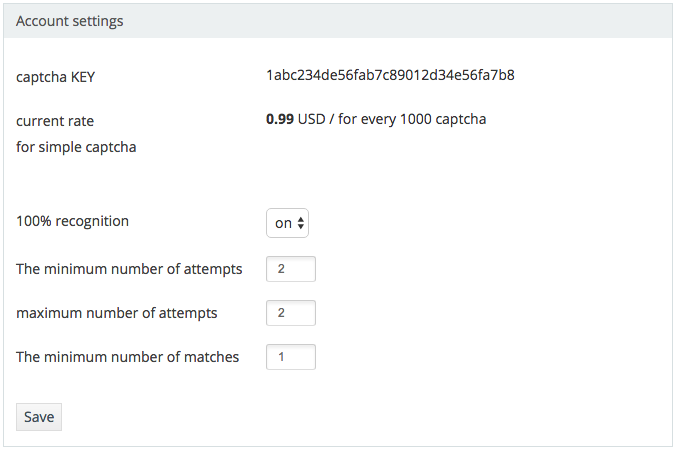
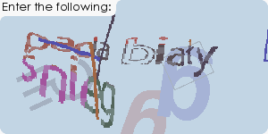
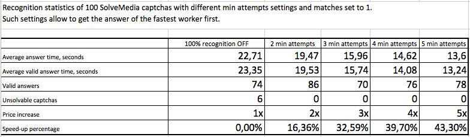
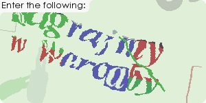

# Recognition speedup

One of our users decided to perform a test of our 100% recognition option and wrote an article about his investigation. We've translated it from Russian to English to share with you:

Recently 2Captcha published an article about their "100% recognition option": https://2captcha.com/blog/for_webmaster/100percenten

I had an idea that their algorithm can speed up the recognition process that's important in my case as I solve lots of SolveMedia captchas.

With the following settings:

* The minimum number of attempts = 2
* The minimum number of matches = 1

captcha will be sent to two workers at the same time and the first answer will be returned.

As I want to get the answer as fast as possible then I decided to test 100% recognition with different settings and check if it will speed up the process and also check if the accuracy will fall.

## Hypotheses:
I had two hypotheses to test:

1. If I increase the min number of attempts (more workers solve the captcha at the same time) then my chance that captcha will be solved by a *fast* worker is higher and captcha will be solved faster.

2. Number of valid answers will fall as *fast* worker can provide invalid answers.

## Testing method:
I wrote a scipt on PHP that every seconds sends a captcha from the folder with images to the API and then every second tries to get the answer. After getting the answer I write results to CSV log file: file name, captcha ID, answer, recognition time.
Then I ran the script 5 times with different 100% recognition settings using same images. First run was made with 100% recognition disabled, then I increased min number of attempts each time from 2 to 5.

Finally I combined all results into EXCEL table to get summary statistics for each run.

I used a set of 100 solvemedia captcha images as I think that's the most complex captcha that I met. Examples of images:

Those who wish to perform their own text can get the code from this repo.

## Results:
[EXCEL table with statistics](2captcha100percent.xlsx)

Screenshot of statistics table:

1. First hypothesis: speed will grow up. 
**Confirmed!**

When more workers solve the same captcha recognition time decreases. For my tasks the best results are reached when minimal attempts number is set to 3. Price is increased 3 times but solving time is 32.5% less and I prefer speed.

2. Second hypothesis: accuracy will fall.
**Not confirmed!**

Probably for more accurate results I got to use larger image set e.g. 1000 images. As on 100 images one incorrect answer gives 1% of accuracy loss. But generally accuracy remain good enough.

3. Less captchas remain unsolvable.

Also I found that I got less unsolvable results. It cannot be claimed that setting min attempts set to 2 will result in solving 100% of your captchas. When I was getting ready for my test I tried to submit really complex captchas and these captchas were not solved even if I set min attemtps to 4 or 5. Here are examples:

## Comments from 2Captcha.com 
We are happy that our users perform such tests. That helps us to improve our services and fix our issues found during tests. 
For example first results of this test were not so good due to a small issue in captcha distribution algorithm but the author contacted us and we immediately fixed the issue.

If you wish to perform same tests please make small timeouts between your requests to our API. If you will submit 20 captchas with min number of attempts set to 10 then there's a chance that we will be unable to finds 200 of free workers immediately and that will cause a delay for next captcha you submit. That's why we ask to make timeouts between your requests.

