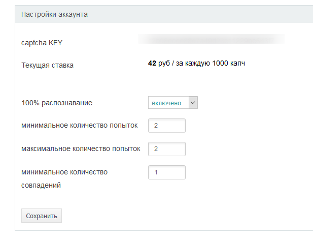
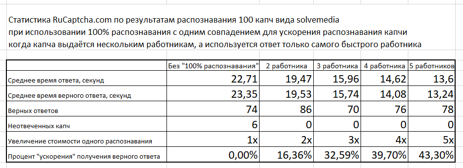

# Увеличение скорости распознавания капчи

Один из заказчиков исследовал нестандартное использование нашего сервиса  и написал по нашей просьбе статью о своём исследовании. Приводим её как есть:

Недавно рукапча опубликовала статью о том, как работает их “100% распознавание”: https://rucaptcha.com/blog/for_webmaster/100percent

Если посмотреть на логику работы этого алгоритма, то можно заметить, что при помощи него можно повышать скорость распознавания, что особенно актуально при работе с решением капч “solvemedia”.

Если поставить в настройках:

* Минимальное количество попыток = 2
* Минимальное количество одинаковых ответов = 1

То капча будет выдана сразу двум работникам и как только кто-то из них ответит, его ответ сразу же будет отдан нам.

Для меня важно получить ответ как можно быстрее, поэтому я решил провести тестирование, поможет ли использование “100% распознавания” в ускорении решения капчи и не приведёт ли это к падению качества распознавания?

## Что проверяем:
У меня было два предположения, которые я хотел проверить:

1. При увеличении количества работников, решающих капчу средняя скорость распознавания уменьшается, т.к. повышается вероятность попасть на “быстрого” работника.

2. Количество правильных ответов упадёт, т.к. с вероятностью попасть на “быстрого” работника, у нас должна повыситься и вероятность попадения на работника, который ответит “123” и такой ответ он даст быстрее, чем ответ нормального работника.

## Методика исследования:
Мною написан скрипт на PHP, который с таймаутом в 1 секунду засылает картинки из папки и после получения ID капчи начинает каждую секунду запрашивать ответ. После получения ответа скрипт записывает в лог  имя файла, ID капчи, ответ на неё и время за которое она была распознана.
После этого я 5 раз запускал скрипт с одними и теми же картинками. Первый раз я запустил его с обычными настройками, без “100% распознавания”, второй раз я выставил настройки так, чтобы каждая капча выдавалась двум работника, потом запускал  с настройками чтобы капча выдавалась  3, 4, и 5 работникам.

После этого я собрал все логи в единую таблицу в EXCEL и  посчитал статистику по каждой пачке. 
Для теста я использовал 100 капч вида “solvemedia”. Выбор в пользу этих капч был сделан из-за того, что сейчас это самая сложная капча, по моему мнению. Примеры этой капчи:

Для тех, кто хочет провести собственный тест скрипт и тестовые капчи доступны в этом репозитории.

## Результаты:
[xls файл с данными по каждой капче](rucaptcha100percent.xlsx)

Скриншот итоговой статистики

1. Первое предположение, увеличение скорости распознавания:
Подтвердилось!
При увеличении количества работников, которым выдана капча, уменьшается время распознавания. Для своих задач я определил оптимальную настройку в 3 работника - стоимость распознавания увеличивается лишь в три раза, а скорость распознавания растёт на 32,5%, что очень важно для моих задач

2. Второе предположение: “количество верных ответов упадёт”
Не подтвердилось!
Возможно, для более точных результатов нужна выборка не менее 1000 капч, т.к. при выборке в 100 капч один неверный ответ даёт отклонение в 1%, но в целом  можно сделать вывод, что количество верных ответов не уменьшается.

3. Не решённых капч становится меньше.
Дополнительно можно заметить, что количество капч, которые работники отказались решать уменьшилось. Нельзя утверждать, что при настройке “минимум 2 работника решают мои капчи” все 100% Ваших капчу будут решены. Когда я готовился к этому эксперименту, я пробовал засылать совсем уж нерешаемые капчи и их не решали не только при “минимум 2 работника”, но даже и при настройке “минимум 4 работника”. Примеры таких капч:

## Комментарии RuCaptcha.com 
Мы благодарны, что кто-то делает такие тестирования. Это помогает нам развивать сервис и исправлять проблемы, которые были выявлены во время подобных тестов. Например при этом тесте изначально были получены не такие красивые результаты, т.к. в логике раздачи капч работникам была небольшая ошибка, но автор статьи связался с нами и мы оперативно всё исправили.
Хотим обратить Ваше внимание, что если Вы будете проводить аналогичное тестирование - делайте небольшой таймаут между загрузками капчи. Если вы единовременно загружаете 20 капч с  настройкой “раздать 10 работникам”, то у нас может не оказаться 200 свободных работников в этот момент и тогда первые капчи решатся быстрее, а вот время решения последующих - увеличится. Поэтому просим при загрузке капч делать небольшую паузу.

